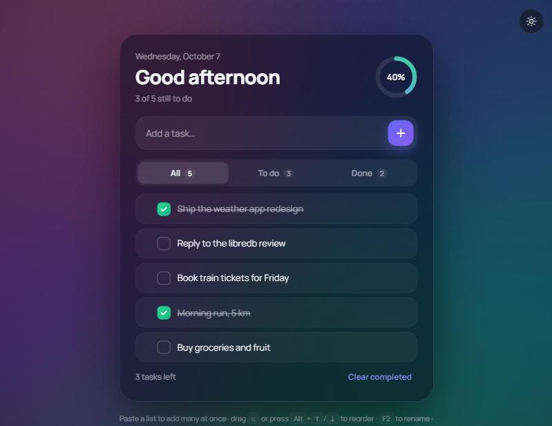

# To-do

A to-do list that feels good to use: ticks draw themselves, finished tasks get a burst of confetti, rows slide into place when you reorder or filter, and a progress ring fills as the day goes on.

**Live:** https://jeevan2410.github.io/TO-DO-LIST/



## Features

- Add tasks, or paste a list and every line becomes its own task (bullets and numbers are stripped).
- Tick off, rename (edit button or <kbd>F2</kbd>), delete with **Undo** (button or <kbd>Ctrl</kbd>+<kbd>Z</kbd>), clear completed.
- Drag the handle to reorder, or use <kbd>Alt</kbd>+<kbd>↑</kbd>/<kbd>↓</kbd>. Works with touch too.
- Filters for all, to do and done, kept in the URL (`#active`, `#done`) so the back button works.
- Greeting and date, a progress ring, and a celebration when everything is done.
- Saved in your browser and kept in sync across open tabs.
- Dark and light themes; `prefers-reduced-motion` turns the motion off; labelled controls and screen-reader announcements.

## How it works

Plain HTML, CSS and ES modules, with no build step.

| File | Job |
|---|---|
| `src/store.js` | Pure list operations: add, toggle, rename, remove, reorder, filters, parsing what's stored |
| `src/main.js` | Rendering with reused rows and FLIP animations, drag and drop, undo, keyboard, theme |
| `src/confetti.js` | A small canvas confetti burst |

The first version saved the list's raw HTML and rebuilt it with `innerHTML`, so a task like `` would run as code. Tasks are now stored as JSON, checked when they are read back, and always shown with `textContent`.

## Run it

Serve the folder with any static server, for example:

```bash
npx serve .
```

Tests use Node's built-in runner (Node 20+):

```bash
npm test
```
